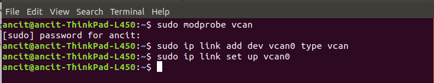
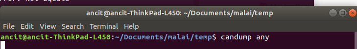

# Introduction to CAN

# Hands ON - CAN Commands in Linux

### cansend, candump, cangen commands

##### Setup Virtual CAN

 

##### Listening to CAN Bus using CANDUMP

 

# Hands ON - RAW CAN using Python

### Python API used can-utils, python-can

# Introduction to Message Database [dbc,dbf,kcd]

# Hands ON - Handling DBC using Python

### Python API using cantools

# Hands ON - Sending / Receiving Messages using DBC + Python
